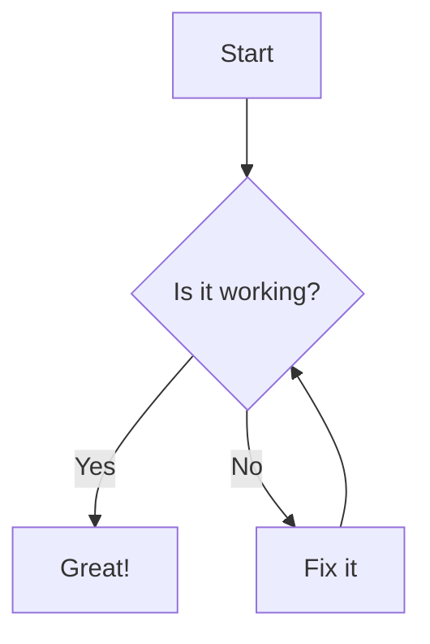

# Blog Repository – Writing Posts in Markdown

This repository contains the markdown source files for blog posts published on the main website. Follow these guidelines to ensure your posts render beautifully and professionally.

---

## How to Write a Blog Post

### 1. Create a Markdown File
- Name your file descriptively, e.g., `my-first-post.md`.

### 2. Add YAML Front Matter
At the top of your file, include:
```markdown
---
title: "Your Post Title"
date: "YYYY-MM-DD"
description: "A short summary of the post."
author: "Your Name"
tags: ["tag1", "tag2", ...]
category: "tutorial"  # or "research", "update", etc.
readTime: "5 min read"
---
```

### 3. Write Your Content in Markdown

You can use all standard markdown features, plus the following enhanced features:

---

## Enhanced Features

### Table Captions

- To add a caption to a table, place a line starting with `^[table-caption]("Your caption here")` **immediately before** the table.
- The caption will be rendered as a left-aligned, numbered caption. Only "Table N." is bold.

**Example:**
```markdown
^[table-caption]("Monthly Statistics")
| Month | Value |
|-------|-------|
| Jan   | 100   |
| Feb   | 120   |
```

---

### Figures: SVG and Mermaid Diagrams

You can include live, interactive diagrams using SVG or Mermaid code blocks. These are rendered as full-width, responsive figures with captions and numbering.

#### SVG Diagrams

- Use a code block with `svg` as the language.
- Place the caption **immediately after** the code block using `^[figure-caption]("Your caption here")`.

**Example:**
```markdown
```svg
<svg width="200" height="100">
  <rect width="200" height="100" fill="#e0e0e0" stroke="#333" stroke-width="2"/>
  <text x="100" y="55" font-size="20" text-anchor="middle" fill="#333">SVG Example</text>
</svg>
```
^[figure-caption]("A simple SVG rectangle with text")
```

#### Mermaid Diagrams

- Use a code block with `mermaid` as the language.
- Place the caption **immediately after** the code block using `^[figure-caption]("Your caption here")`.

**Example:**
```markdown

^[figure-caption]("A simple Mermaid flowchart")
```

**Figure Rules:**
- Each figure (SVG or Mermaid) is automatically numbered in the order it appears in the post.
- The caption is centered below the figure, with numbering: **Figure N.** Caption text.
- Only "Figure N." is bold.

---

### Code Blocks

- Use triple backticks and specify the language for syntax highlighting.
- Code blocks have line numbers and a copy button.

**Example:**
```markdown
```python
def hello():
    print("Hello, world!")
```
```

---

### Math (LaTeX)

- Inline: `$E = mc^2$`
- Block:
  ```markdown
  $$
  \int_{-\infty}^{\infty} e^{-x^2} dx = \sqrt{\pi}
  $$
  ```
- Numbered block (align):
  ```markdown
  $$
  \begin{align}
      a^2 + b^2 &= c^2 \\
      e^{i\pi} + 1 &= 0
  \end{align}
  $$
  ```

---

### Images with Captions and Width

- Use standard markdown image syntax.
- The caption is taken from the image title.
- Width can be set with `{width=XX%}` in the title.

**Example:**
```markdown

```

---

### Callouts (Tips)

- Use blockquotes with an emoji and bold label for tips, warnings, etc.

**Example:**
```markdown
> 💡 **Tip:** You can copy the code above using the copy button.
```

---

### Lists and Links

- Bullet list:
  ```markdown
  - Item 1
  - Item 2
  ```
- Numbered list:
  ```markdown
  1. First
  2. Second
  ```
- Link: `[My Website](../index.html)`

---

### Inline Code

Use backticks: `` `pip install numpy` ``

---

### Horizontal Rule

Use `---` for a horizontal line.

---

## Adding Your Post to the Blog

1. Commit and push your markdown file to this repo.
2. Edit `blog-index.json` and add an entry for your post:
   ```json
   [
     {
       "filename": "https://raw.githubusercontent.com/YourUsername/YourBlogRepo/main/my-first-post.md",
       "order": 1
     },
     ...
   ]
   ```
3. Commit and push the updated `blog-index.json`.
4. Your post will appear on the main website automatically.

---

## Best Practices

- Use clear, descriptive titles and summaries.
- Add relevant tags and categories for discoverability.
- Use math, code, images, tables, and diagrams for technical clarity.
- Keep posts professional and well-structured.
- Preview your post on GitHub to check markdown rendering.
- Use the `^[table-caption]("...")` and `^[figure-caption]("...")` features for professional captions and numbering.

---

Happy blogging!
