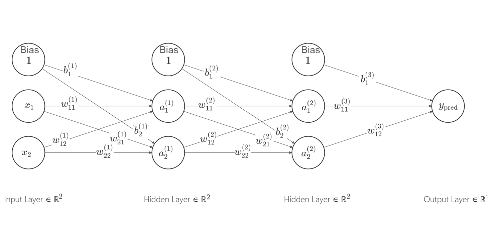

# Introduction

Backpropagation is a fundamental algorithm used to train feedforward neural networks. It's a method for adjusting the network's weights and biases to minimize the error between the predicted outputs and the actual target values. Backpropagation is the mathematical technique that allows us to efficiently find the gradients of the error function with respect to the network's parameters, which is crucial for training neural networks using gradient descent optimization. It involves the chain rule and plays a central role in the learning process of neural networks.

**Scenario:**
We have a feedforward neural network with two hidden layers and two neurons in each layer. Here's the network architecture:

- **Input Layer (2 features):** Inputs are $x_1$ and $x_2$.
- **First Hidden Layer (2 neurons):** Weights $w_{11}^{(1)}$, $w_{12}^{(1)}$, $w_{21}^{(1)}$, $w_{22}^{(1)}$, biases $b_1^{(1)}$, $b_2^{(1)}$.
- **Second Hidden Layer (2 neurons):** Weights $w_{11}^{(2)}$, $w_{12}^{(2)}$, $w_{21}^{(2)}$, $w_{22}^{(2)}$, biases $b_1^{(2)}$, $b_2^{(2)}$.
- **Output Layer (1 neuron):** Weights $w_{11}^{(3)}$, $w_{12}^{(3)}$, bias $b_1^{(3)}$.
- **Learning rate:** $\alpha$

The goal of training is to make this neural network learn a simple linear function:

$$
f(x_1, x_2) = 2x_1 + 3x_2 + 10
$$

## Step 1: Forward Pass

1. Start with some initial random weights and biases.
2. Compute the weighted sum ($z$ values) and activation function (e.g., sigmoid $a = \frac{1}{1 + e^{-z}}$ or ReLU $a = \max(0, z)$) for each neuron in the hidden and output layers.

**First Hidden Layer:**

$$
\begin{align*}
z_1^{(1)} &= 1 \cdot b_1^{(1)} + x_1 \cdot w_{11}^{(1)} + x_2 \cdot w_{12}^{(1)} \\
z_2^{(1)} &= 1 \cdot b_2^{(1)} + x_1 \cdot w_{21}^{(1)} + x_2 \cdot w_{22}^{(1)} \\
a_1^{(1)} &= \text{activation}(z_1^{(1)}) \\
a_2^{(1)} &= \text{activation}(z_2^{(1)})
\end{align*}
$$

**Second Hidden Layer:**

$$
\begin{align*}
z_1^{(2)} &= 1 \cdot b_1^{(2)} + a_1^{(1)} \cdot w_{11}^{(2)} + a_2^{(1)} \cdot w_{12}^{(2)} \\
z_2^{(2)} &= 1 \cdot b_2^{(2)} + a_1^{(1)} \cdot w_{21}^{(2)} + a_2^{(1)} \cdot w_{22}^{(2)} \\
a_1^{(2)} &= \text{activation}(z_1^{(2)}) \\
a_2^{(2)} &= \text{activation}(z_2^{(2)})
\end{align*}
$$

**Output Layer:**

$$
\begin{align*}
z_1^{(3)} &= 1 \cdot b_1^{(3)} + a_1^{(2)} \cdot w_{11}^{(3)} + a_2^{(2)} \cdot w_{12}^{(3)} \\
y_{\text{pred}} &= \text{activation}(z_1^{(3)})
\end{align*}
$$

> 💡 **Tip:**
> When we configure all the activation functions in a feed-forward neural network model to resemble $a=z$, we essentially transform it into a linear regression model. Conversely, by applying the sigmoid activation function exclusively to the output layer, we effectively convert it into a logistic regression model.

## Step 2: Calculate the Prediction Error (Loss)

Compute the error between the predicted output $y_{\text{pred}}$ and the actual target value $y_{\text{true}}$ using a loss function (e.g., Mean Squared Error):

$$
L = \frac{1}{2} (y_{\text{true}} - y_{\text{pred}})^2
$$

## Step 3: Backward Pass (Backpropagation)

Starting from the output layer and moving backward through the network, update all parameters using Gradient Descent:

$$
\theta \leftarrow \theta - \alpha \cdot \frac{\partial L}{\partial \theta}
$$

### Output Layer

$$
\begin{align*}
\delta_1^{(3)} &= \frac{\partial L}{\partial y_{\text{pred}}} \cdot \frac{\partial y_{\text{pred}}}{\partial z_1^{(3)}} = -(y_{\text{true}} - y_{\text{pred}}) \cdot \frac{dy_{\text{pred}}}{dz_1^{(3)}} \\
w_{11}^{(3)} &\leftarrow w_{11}^{(3)} - \alpha \cdot \delta_1^{(3)} \cdot a_1^{(2)} \\
w_{12}^{(3)} &\leftarrow w_{12}^{(3)} - \alpha \cdot \delta_1^{(3)} \cdot a_2^{(2)} \\
b_1^{(3)} &\leftarrow b_1^{(3)} - \alpha \cdot \delta_1^{(3)}
\end{align*}
$$

### Second Hidden Layer

$$
\begin{align*}
\delta_1^{(2)} &= \delta_1^{(3)} \cdot w_{11}^{(3)} \cdot \frac{da_1^{(2)}}{dz_1^{(2)}} \\
\delta_2^{(2)} &= \delta_1^{(3)} \cdot w_{12}^{(3)} \cdot \frac{da_2^{(2)}}{dz_2^{(2)}} \\
w_{11}^{(2)} &\leftarrow w_{11}^{(2)} - \alpha \cdot \delta_1^{(2)} \cdot a_1^{(1)} \\
w_{12}^{(2)} &\leftarrow w_{12}^{(2)} - \alpha \cdot \delta_2^{(2)} \cdot a_2^{(1)} \\
w_{21}^{(2)} &\leftarrow w_{21}^{(2)} - \alpha \cdot \delta_1^{(2)} \cdot a_1^{(1)} \\
w_{22}^{(2)} &\leftarrow w_{22}^{(2)} - \alpha \cdot \delta_2^{(2)} \cdot a_2^{(1)} \\
b_1^{(2)} &\leftarrow b_1^{(2)} - \alpha \cdot \delta_1^{(2)} \\
b_2^{(2)} &\leftarrow b_2^{(2)} - \alpha \cdot \delta_2^{(2)}
\end{align*}
$$

### First Hidden Layer

$$
\begin{align*}
\delta_1^{(1)} &= \delta_1^{(2)} \cdot w_{11}^{(2)} \cdot \frac{da_1^{(1)}}{dz_1^{(1)}} \\
\delta_2^{(1)} &= \delta_2^{(2)} \cdot w_{12}^{(2)} \cdot \frac{da_2^{(1)}}{dz_2^{(1)}} \\
w_{11}^{(1)} &\leftarrow w_{11}^{(1)} - \alpha \cdot \delta_1^{(1)} \cdot x_1 \\
w_{12}^{(1)} &\leftarrow w_{12}^{(1)} - \alpha \cdot \delta_2^{(1)} \cdot x_2 \\
w_{21}^{(1)} &\leftarrow w_{21}^{(1)} - \alpha \cdot \delta_1^{(1)} \cdot x_1 \\
w_{22}^{(1)} &\leftarrow w_{22}^{(1)} - \alpha \cdot \delta_2^{(1)} \cdot x_2 \\
b_1^{(1)} &\leftarrow b_1^{(1)} - \alpha \cdot \delta_1^{(1)} \\
b_2^{(1)} &\leftarrow b_2^{(1)} - \alpha \cdot \delta_2^{(1)}
\end{align*}
$$

## Step 4: Repeat

Repeat the forward and backward passes for a specified number of iterations or until the error converges to a satisfactory level.

This process continues iteratively until the network's weights and biases are adjusted to minimize the prediction error, allowing the network to approximate the desired function.
