# Overview

State-space representation is the lingua franca of modern dynamic analysis.  By recasting **second- or higher-order differential equations** into a coupled set of **first-order** equations, it delivers a mathematically elegant and computationally efficient framework that unifies simulation, control design, and system identification.

This article walks through the full pipeline for **mechanical vibration systems**—from the classical $\mathbf{M}\ddot{\mathbf{q}} + \mathbf{C}\dot{\mathbf{q}} + \mathbf{K}\mathbf{q}=\mathbf{f}(t)$ description to both continuous and discrete state-space forms—culminating in a *general-purpose* Python routine.  We emphasise **parametric modelling**, where the analyst manipulates the physical matrices $(\mathbf{M},\mathbf{C},\mathbf{K})$ directly, making the approach applicable to everything from a single-degree-of-freedom (SDOF) oscillator to high-fidelity finite-element models.

---

## 1 From Physical Parameters to State Variables

Consider an $n$-DOF structural system

$$
\mathbf{M}\ddot{\mathbf{q}}(t)+\mathbf{C}\dot{\mathbf{q}}(t)+\mathbf{K}\mathbf{q}(t)=\mathbf{f}(t),
$$

where $\mathbf{q}$ is the displacement vector, $\mathbf{M}$ the mass matrix (positive definite), $\mathbf{C}$ the damping matrix (often Rayleigh or proportional), $\mathbf{K}$ the stiffness matrix, and $\mathbf{f}(t)$ the external force vector.

Define the state vector as the concatenation of displacements and velocities

$$
\mathbf{x}(t)=\begin{bmatrix}\mathbf{q}(t)\\\dot{\mathbf{q}}(t)\end{bmatrix} \in \mathbb{R}^{2n}.
$$

Taking time derivatives yields the **continuous** state-space model

$$
\dot{\mathbf{x}}(t)=\underbrace{\begin{bmatrix}
\mathbf{0} & \mathbf{I}\\[-1ex]
-\mathbf{M}^{-1}\mathbf{K} & -\mathbf{M}^{-1}\mathbf{C}
\end{bmatrix}}_{\mathbf{A}_c}
\mathbf{x}(t)
\;+
\underbrace{\begin{bmatrix}
\mathbf{0}\\[-1ex]
\mathbf{M}^{-1}
\end{bmatrix}}_{\mathbf{B}_c}
\mathbf{f}(t).
$$

The output equation is problem-dependent; for full-state analysis we simply take

$$
\mathbf{y}(t)=\mathbf{C}_c\,\mathbf{x}(t),\qquad \mathbf{C}_c=\begin{bmatrix}\mathbf{I}&\mathbf{0}\\\mathbf{0}&\mathbf{I}\end{bmatrix}.
$$

---

## 2 Exact Discretisation

Digital controllers and numerical solvers operate in discrete time.  Assuming a zero-order-hold input over the interval $[k\Delta t,(k+1)\Delta t)$ the **exact** discrete matrices are

$$
\mathbf{A}_d=e^{\mathbf{A}_c\Delta t},\qquad
\mathbf{B}_d=\int_0^{\Delta t}e^{\mathbf{A}_c\tau}\,d\tau\;\mathbf{B}_c=(\mathbf{A}_c^{-1})(\mathbf{A}_d-\mathbf{I})\mathbf{B}_c.
$$

For small time-steps—or when computational speed outweighs spectral accuracy—the first-order approximation $\mathbf{A}_d\approx\mathbf{I}+\mathbf{A}_c\Delta t$, $\mathbf{B}_d\approx\mathbf{B}_c\Delta t$ performs admirably.

---

## 3 Visualising the Transformation

```svg
<svg width="700" height="320" viewBox="0 0 700 320" xmlns="http://www.w3.org/2000/svg">
  <!-- Background gradient -->
  <defs>
    <linearGradient id="bgGrad" x1="0%" y1="0%" x2="100%" y2="0%">
      <stop offset="0%" style="stop-color:#f8fafc;stop-opacity:1" />
      <stop offset="100%" style="stop-color:#e2e8f0;stop-opacity:1" />
    </linearGradient>
    <linearGradient id="leftGrad" x1="0%" y1="0%" x2="0%" y2="100%">
      <stop offset="0%" style="stop-color:#dbeafe;stop-opacity:1" />
      <stop offset="100%" style="stop-color:#bfdbfe;stop-opacity:1" />
    </linearGradient>
    <linearGradient id="rightGrad" x1="0%" y1="0%" x2="0%" y2="100%">
      <stop offset="0%" style="stop-color:#ecfdf5;stop-opacity:1" />
      <stop offset="100%" style="stop-color:#d1fae5;stop-opacity:1" />
    </linearGradient>
    <filter id="shadow" x="-50%" y="-50%" width="200%" height="200%">
      <feDropShadow dx="2" dy="4" stdDeviation="3" flood-opacity="0.15"/>
    </filter>
    <marker id="arrow" markerWidth="12" markerHeight="10" refX="12" refY="5" orient="auto" markerUnits="strokeWidth">
      <polygon points="0,0 12,5 0,10" fill="#475569" stroke="#475569" stroke-width="1"/>
    </marker>
  </defs>
  
  <!-- Background -->
  <rect width="700" height="320" fill="url(#bgGrad)"/>
  
  <!-- Title -->
  <text x="350" y="35" text-anchor="middle" font-size="20" font-weight="bold" fill="#1e293b" font-family="Arial, sans-serif">Mathematical Transformation: From Higher-Order to First-Order Systems</text>
  
  <!-- Left container: Higher-order ODE -->
  <rect x="40" y="80" width="260" height="180" rx="12" ry="12" fill="url(#leftGrad)" stroke="#3b82f6" stroke-width="2" filter="url(#shadow)"/>
  
  <!-- Left content -->
  <text x="170" y="110" text-anchor="middle" font-size="16" font-weight="bold" fill="#1e40af" font-family="Arial, sans-serif">Higher-Order ODE</text>
  <text x="170" y="140" text-anchor="middle" font-size="13" fill="#1e40af" font-family="Times, serif">M q̈ + C q̇ + K q = f(t)</text>
  
  <!-- Matrix representation in left box -->
  <g transform="translate(80, 160)">
    <rect width="180" height="75" rx="6" fill="#ffffff" stroke="#60a5fa" stroke-width="1" opacity="0.9"/>
    <text x="90" y="20" text-anchor="middle" font-size="11" fill="#1e40af" font-family="Arial, sans-serif">n-th order system</text>
    <text x="90" y="35" text-anchor="middle" font-size="10" fill="#64748b" font-family="Arial, sans-serif">• Coupled physics</text>
    <text x="90" y="48" text-anchor="middle" font-size="10" fill="#64748b" font-family="Arial, sans-serif">• Matrix inversion required</text>
    <text x="90" y="61" text-anchor="middle" font-size="10" fill="#64748b" font-family="Arial, sans-serif">• Higher-order derivatives</text>
  </g>
  
  <!-- Transformation arrow -->
  <g stroke="#475569" stroke-width="3" fill="none">
    <path d="M 310 170 Q 350 150 390 170" marker-end="url(#arrow)"/>
  </g>
  <text x="350" y="145" text-anchor="middle" font-size="12" font-weight="bold" fill="#475569" font-family="Arial, sans-serif">Transform</text>
  <text x="350" y="200" text-anchor="middle" font-size="11" fill="#64748b" font-family="Arial, sans-serif">x = [q; q̇]</text>
  
  <!-- Right container: State-space -->
  <rect x="400" y="80" width="260" height="180" rx="12" ry="12" fill="url(#rightGrad)" stroke="#10b981" stroke-width="2" filter="url(#shadow)"/>
  
  <!-- Right content -->
  <text x="530" y="110" text-anchor="middle" font-size="16" font-weight="bold" fill="#047857" font-family="Arial, sans-serif">State-Space Form</text>
  <text x="530" y="140" text-anchor="middle" font-size="13" fill="#047857" font-family="Times, serif">ẋ = A x + B f(t)</text>
  
  <!-- Matrix representation in right box -->
  <g transform="translate(420, 160)">
    <rect width="220" height="75" rx="6" fill="#ffffff" stroke="#34d399" stroke-width="1" opacity="0.9"/>
    <text x="110" y="20" text-anchor="middle" font-size="11" fill="#047857" font-family="Arial, sans-serif">2n first-order equations</text>
    <text x="110" y="35" text-anchor="middle" font-size="10" fill="#64748b" font-family="Arial, sans-serif">• Unified simulation framework</text>
    <text x="110" y="48" text-anchor="middle" font-size="10" fill="#64748b" font-family="Arial, sans-serif">• Efficient numerical integration</text>
    <text x="110" y="61" text-anchor="middle" font-size="10" fill="#64748b" font-family="Arial, sans-serif">• Modern control theory ready</text>
  </g>
  
  <!-- Mathematical notation at bottom -->
  <g transform="translate(50, 280)">
    <rect width="600" height="30" rx="5" fill="#f1f5f9" stroke="#cbd5e1" stroke-width="1"/>
    <text x="300" y="20" text-anchor="middle" font-size="12" fill="#334155" font-family="Times, serif">
      A = [0 I; -M⁻¹K -M⁻¹C],   B = [0; M⁻¹],   x = [q; q̇] ∈ ℝ²ⁿ
    </text>
  </g>
</svg>
```
^[figure-caption]("Conceptual map: transforming a higher-order matrix ODE into a first-order state-space model")

---

## 4 Generic Simulation Code

The snippet below implements a **dimension-agnostic** simulator.  Provide $(\mathbf{M},\mathbf{C},\mathbf{K})$, an external force function, and numerical settings—nothing else.

```python
import numpy as np
from scipy.linalg import expm

def simulate_state_space(M, C, K, force_func, dt, t_end,
                         x0=None, v0=None, exact=True):
    """Simulate an n-DOF system via state-space.

    Parameters
    ----------
    M, C, K : (n, n) array_like
        Mass, damping, and stiffness matrices.
    force_func : callable
        Returns force vector f(t) at time t.
    dt : float
        Time step size.
    t_end : float
        Simulation horizon.
    x0, v0 : (n,) array_like, optional
        Initial displacement and velocity.
    exact : bool, default True
        Use exact discretisation (matrix exponential) if True; otherwise first-order.

    Returns
    -------
    t, q, v, a : ndarray
        Time vector and response arrays.
    """
    M, C, K = map(np.asarray, (M, C, K))
    n = M.shape[0]

    # Continuous matrices
    Ac = np.block([[np.zeros((n, n)), np.eye(n)],
                   [-np.linalg.solve(M, K), -np.linalg.solve(M, C)]])
    Bc = np.block([[np.zeros((n, n))], [np.linalg.solve(M, np.eye(n))]])

    # Discretisation
    if exact:
        Ad = expm(Ac*dt)
        Bd = np.linalg.solve(Ac, (Ad - np.eye(2*n))) @ Bc
    else:  # first-order hold
        Ad = np.eye(2*n) + Ac*dt
        Bd = Bc*dt

    # Initial state
    x = np.concatenate([(np.zeros(n) if x0 is None else np.asarray(x0)),
                        (np.zeros(n) if v0 is None else np.asarray(v0))])

    # Pre-allocate
    t = np.arange(0, t_end+dt, dt)
    q = np.zeros((n, t.size))
    v = np.zeros_like(q)
    a = np.zeros_like(q)

    # Output selection matrices
    Cdisp = np.block([np.eye(n), np.zeros((n, n))])
    Cvel  = np.block([np.zeros((n, n)), np.eye(n)])
    Cacc  = -np.linalg.solve(M, K) @ Cdisp - np.linalg.solve(M, C) @ Cvel
    Dacc  = np.linalg.solve(M, np.eye(n))

    # Time integration loop
    for k, tk in enumerate(t):
        q[:, k], v[:, k] = Cdisp @ x, Cvel @ x
        a[:, k] = Cacc @ x + Dacc @ force_func(tk)
        if k < t.size-1:
            x = Ad @ x + Bd @ force_func(tk)

    return t, q, v, a
```

> 💡 **Tip:** Replace the dense `np.linalg.solve` calls with sparse solvers (e.g., `scipy.sparse.linalg.spsolve`) for large finite-element models.

---

## 5 SDOF Interactive Example

For a web demonstration one might expose only the *natural frequency* $\omega_n$ and *damping ratio* $\zeta$ to the user, infer $(m, c, k)$ for **unit mass**, and let the user pick a forcing function (step, impulse, harmonic).  The simulator above then powers interactive plots of displacement, velocity, and acceleration.

```mermaid
graph LR
    A["🎛️ User Interface<br/>• Natural frequency ωₙ<br/>• Damping ratio ζ<br/>• Force type f(t)"] 
    B["⚙️ Parameter Engine<br/>• m = 1.0 kg<br/>• k = m×ωₙ²<br/>• c = 2ζ√(km)"]
    C["🧮 State-Space Core<br/>• Build M, C, K matrices<br/>• Form Ac, Bc<br/>• Discretize → Ad, Bd"]
    D["📊 Visualization<br/>• Displacement q(t)<br/>• Velocity q̇(t)<br/>• Acceleration q̈(t)"]
    E["🌐 Interactive Web App<br/>• Real-time plots<br/>• Parameter sweeps<br/>• Export data"]
    
    A -->|"ωₙ, ζ, force"| B
    B -->|"M, C, K"| C
    C -->|"t, q, v, a"| D
    D --> E
    
    style A fill:#e1f5fe,stroke:#0277bd,stroke-width:2px
    style B fill:#f3e5f5,stroke:#7b1fa2,stroke-width:2px
    style C fill:#e8f5e8,stroke:#2e7d32,stroke-width:2px
    style D fill:#fff3e0,stroke:#f57c00,stroke-width:2px
    style E fill:#fce4ec,stroke:#c2185b,stroke-width:2px
```


^[figure-caption]("Client-side pipeline for an interactive SDOF vibration app")

```svg
<svg width="750" height="400" viewBox="0 0 750 400" xmlns="http://www.w3.org/2000/svg">
  <!-- Background -->
  <defs>
    <linearGradient id="appBg" x1="0%" y1="0%" x2="100%" y2="100%">
      <stop offset="0%" style="stop-color:#f8fafc;stop-opacity:1" />
      <stop offset="100%" style="stop-color:#e2e8f0;stop-opacity:1" />
    </linearGradient>
    <filter id="cardShadow" x="-20%" y="-20%" width="140%" height="140%">
      <feDropShadow dx="2" dy="4" stdDeviation="4" flood-opacity="0.2"/>
    </filter>
  </defs>
  
  <rect width="750" height="400" fill="url(#appBg)"/>
  
  <!-- Title -->
  <text x="375" y="30" text-anchor="middle" font-size="18" font-weight="bold" fill="#1e293b" font-family="Arial, sans-serif">Interactive SDOF Vibration Analysis Tool</text>
  
  <!-- Control Panel -->
  <rect x="30" y="60" width="200" height="310" rx="8" fill="#ffffff" stroke="#cbd5e1" stroke-width="1" filter="url(#cardShadow)"/>
  <text x="130" y="85" text-anchor="middle" font-size="14" font-weight="bold" fill="#334155" font-family="Arial, sans-serif">Control Panel</text>
  
  <!-- Natural frequency slider -->
  <text x="50" y="110" font-size="11" fill="#475569" font-family="Arial, sans-serif">Natural Frequency ωₙ (rad/s)</text>
  <rect x="50" y="120" width="160" height="20" rx="10" fill="#e2e8f0" stroke="#94a3b8" stroke-width="1"/>
  <circle cx="130" cy="130" r="8" fill="#3b82f6" stroke="#1e40af" stroke-width="2"/>
  <text x="50" y="150" font-size="10" fill="#64748b" font-family="monospace">ωₙ = 6.28</text>
  
  <!-- Damping ratio slider -->
  <text x="50" y="175" font-size="11" fill="#475569" font-family="Arial, sans-serif">Damping Ratio ζ</text>
  <rect x="50" y="185" width="160" height="20" rx="10" fill="#e2e8f0" stroke="#94a3b8" stroke-width="1"/>
  <circle cx="90" cy="195" r="8" fill="#10b981" stroke="#047857" stroke-width="2"/>
  <text x="50" y="215" font-size="10" fill="#64748b" font-family="monospace">ζ = 0.05</text>
  
  <!-- Force selection -->
  <text x="50" y="240" font-size="11" fill="#475569" font-family="Arial, sans-serif">Force Function</text>
  <rect x="50" y="250" width="160" height="25" rx="4" fill="#f8fafc" stroke="#94a3b8" stroke-width="1"/>
  <text x="130" y="267" text-anchor="middle" font-size="10" fill="#334155" font-family="Arial, sans-serif">Step Input ▼</text>
  
  <!-- Simulate button -->
  <rect x="50" y="290" width="160" height="30" rx="6" fill="#3b82f6" stroke="#1e40af" stroke-width="1"/>
  <text x="130" y="310" text-anchor="middle" font-size="12" font-weight="bold" fill="#ffffff" font-family="Arial, sans-serif">SIMULATE</text>
  
  <!-- Plot area -->
  <rect x="260" y="60" width="460" height="310" rx="8" fill="#ffffff" stroke="#cbd5e1" stroke-width="1" filter="url(#cardShadow)"/>
  
  <!-- Plot title and axes -->
  <text x="490" y="85" text-anchor="middle" font-size="14" font-weight="bold" fill="#334155" font-family="Arial, sans-serif">System Response</text>
  
  <!-- Displacement plot -->
  <g transform="translate(280, 100)">
    <rect width="420" height="80" fill="#f8fafc" stroke="#e2e8f0" stroke-width="1"/>
    <text x="10" y="15" font-size="10" font-weight="bold" fill="#dc2626" font-family="Arial, sans-serif">Displacement q(t)</text>
    <path d="M 20 40 Q 120 20 220 50 Q 320 70 420 45" stroke="#dc2626" stroke-width="2" fill="none"/>
    <circle cx="220" cy="50" r="2" fill="#dc2626"/>
  </g>
  
  <!-- Velocity plot -->
  <g transform="translate(280, 190)">
    <rect width="420" height="80" fill="#f8fafc" stroke="#e2e8f0" stroke-width="1"/>
    <text x="10" y="15" font-size="10" font-weight="bold" fill="#2563eb" font-family="Arial, sans-serif">Velocity q̇(t)</text>
    <path d="M 20 60 Q 120 30 220 40 Q 320 50 420 35" stroke="#2563eb" stroke-width="2" fill="none"/>
    <circle cx="220" cy="40" r="2" fill="#2563eb"/>
  </g>
  
  <!-- Acceleration plot -->
  <g transform="translate(280, 280)">
    <rect width="420" height="80" fill="#f8fafc" stroke="#e2e8f0" stroke-width="1"/>
    <text x="10" y="15" font-size="10" font-weight="bold" fill="#059669" font-family="Arial, sans-serif">Acceleration q̈(t)</text>
    <path d="M 20 50 Q 120 70 220 30 Q 320 20 420 40" stroke="#059669" stroke-width="2" fill="none"/>
    <circle cx="220" cy="30" r="2" fill="#059669"/>
  </g>
  
  <!-- Time axis label -->
  <text x="490" y="390" text-anchor="middle" font-size="11" fill="#64748b" font-family="Arial, sans-serif">Time (s)</text>
  
  <!-- Live values display -->
  <g transform="translate(540, 100)">
    <rect width="140" height="60" rx="4" fill="#f1f5f9" stroke="#cbd5e1" stroke-width="1"/>
    <text x="70" y="15" text-anchor="middle" font-size="10" font-weight="bold" fill="#334155" font-family="Arial, sans-serif">Live Values</text>
    <text x="10" y="30" font-size="9" fill="#dc2626" font-family="monospace">q = 0.024 m</text>
    <text x="10" y="42" font-size="9" fill="#2563eb" font-family="monospace">q̇ = -0.15 m/s</text>
    <text x="10" y="54" font-size="9" fill="#059669" font-family="monospace">q̈ = 0.95 m/s²</text>
  </g>
</svg>
```
^[figure-caption]("Professional web application mockup for interactive SDOF vibration analysis with parameter controls and real-time response visualization")

**Technical Implementation Stack:**

1. **Frontend Framework**: React.js or Vue.js for reactive UI components
2. **Numerical Computing**: WebAssembly-compiled NumPy/SciPy via Pyodide
3. **Visualization**: Plotly.js with real-time streaming updates  
4. **Styling**: TailwindCSS for professional appearance
5. **Performance**: Web Workers for computation to maintain 60fps responsiveness

The beauty of the state-space core is that *nothing changes* when you scale up to multiple DOFs—only the matrix sizes grow.

---

## 6 Beyond Linear Time-Invariant Models

Real structures exhibit nonlinearities, parameter drift, and stochastic loading.  Extensions include:

- **Linearisation** about an operating point to retain the state-space form.
- **Time-varying matrices** $\mathbf{A}(t)$, $\mathbf{B}(t)$ for adaptive or damaged structures.
- **Stochastic state-space** with process and measurement noise for *Bayesian filtering* (e.g., Kalman, Unscented, Particle filters).

These topics merit their own articles; the parametric foundation laid here remains the critical first step.

---

## 7 Key Takeaways

- State-space converts cumbersome higher-order ODEs into a compact first-order form.
- Direct use of $(\mathbf{M},\mathbf{C},\mathbf{K})$ preserves physical intuition while accommodating arbitrarily large DOF counts.
- Exact discretisation via the matrix exponential delivers maximum numerical fidelity; first-order approximations suffice for small $\Delta t$.
- A single generic simulator—&#x200B;<code>simulate_state_space</code>&#x200B;—supports SDOF animations *and* massive finite-element models.

> 🎓 **Next Step:** Investigate controllability, observability, and model reduction (e.g., balanced truncation) to streamline high-order models without sacrificing accuracy.

---

# Conclusion

Parametric state-space modelling unlocks a unified, elegant framework for simulating and controlling mechanical vibration systems.  Whether you are evaluating a single sensor mount or orchestrating an active vibration isolation platform, mastering the translation from $\mathbf{M}\text{–}\mathbf{C}\text{–}\mathbf{K}$ to state-space equips you with a flexible, future-proof toolkit.

Feel free to adapt the code and figures provided here in your own projects and teaching material—just remember to cite this post! 