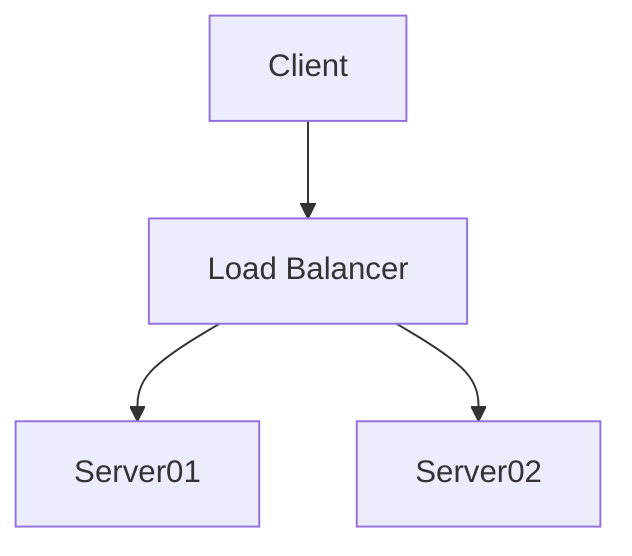

# Sample Blog Post: Full Markdown & Features Demo

This **sample post** demonstrates all the main features supported by the blog system, including:
- Tables with captions and auto-numbering
- Python code blocks (with syntax highlighting, line numbering, copy button)
- Inline and block math (LaTeX)
- Images with captions
- Blockquotes and callouts
- Lists, links, and more
- Mermaid diagrams (rendered)
- SVG graphics (rendered)

---

## 1. Table Example (No Caption)

| Name   | Role     | Score |
|--------|----------|-------|
| Alice  | Engineer | 95    |
| Bob    | Scientist| 88    |
| Carol  | Analyst  | 92    |

---

## 2. Table with Caption

^[table-caption]("Team Performance Scores")

| Name   | Role     | Score |
|--------|----------|-------|
| Alice  | Engineer | 95    |
| Bob    | Scientist| 88    |
| Carol  | Analyst  | 92    |

---

## 3. Python Code Example

```python
def fibonacci(n):
    """Return the nth Fibonacci number."""
    if n <= 0:
        return 0
    elif n == 1:
        return 1
    else:
        return fibonacci(n-1) + fibonacci(n-2)

for i in range(10):
    print(f"Fibonacci({i}) = {fibonacci(i)}")
```

---

## 4. Math Equations

Inline math: $E = mc^2$ is the most famous equation in physics.

Block math:

$$
\int_{-\infty}^{\infty} e^{-x^2} dx = \sqrt{\pi}
$$

Numbered block math:

$$
\begin{align}
    a^2 + b^2 &= c^2 \\
    e^{i\pi} + 1 &= 0
\end{align}
$$

---

## 5. Mermaid Diagram (Rendered)


^[figure-caption]("A simple flowchart rendered from Mermaid code.")

---

## 6. SVG Graphic (Rendered)

```svg
<svg width="200" height="100">
  <rect x="10" y="10" width="180" height="80" fill="#eaf4fb" stroke="#0969da" stroke-width="3"/>
  <circle cx="100" cy="50" r="30" fill="#1a7f37"/>
  <text x="100" y="55" font-size="20" text-anchor="middle" fill="#fff">SVG</text>
</svg>
```
^[figure-caption]("A custom SVG graphic rendered directly in the post.")

---

## 7. Figure/Image with Caption


A plot of the standard normal (Gaussian) distribution.

---

## 8. Blockquote Callout

> 💡 **Tip:** You can copy the code above using the copy button in the top-right corner of the code block.

---

## 9. Lists and Links

- This is a bullet list item
- Another item
    - Nested item

1. Numbered list item
2. Another numbered item

[Visit the main website](../index.html)

---

## 10. Another Table with Caption

^[table-caption]("Monthly Statistics")

| Month | Value |
|-------|-------|
| Jan   | 100   |
| Feb   | 120   |

---

## 11. Inline Code

Use `pip install numpy` to install NumPy.

---

## 12. End of Template

Feel free to use this as a template for your own posts, or add/remove sections to test specific features! 
